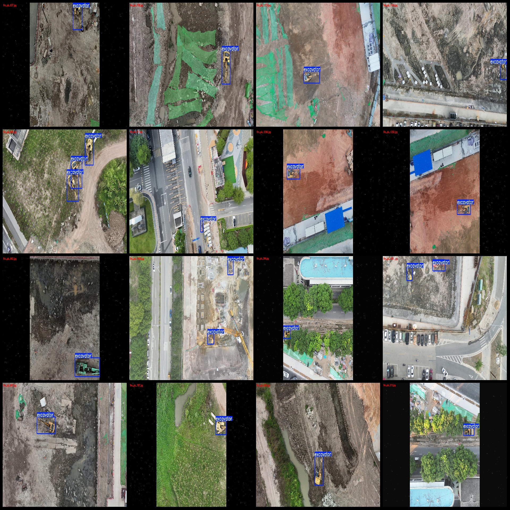
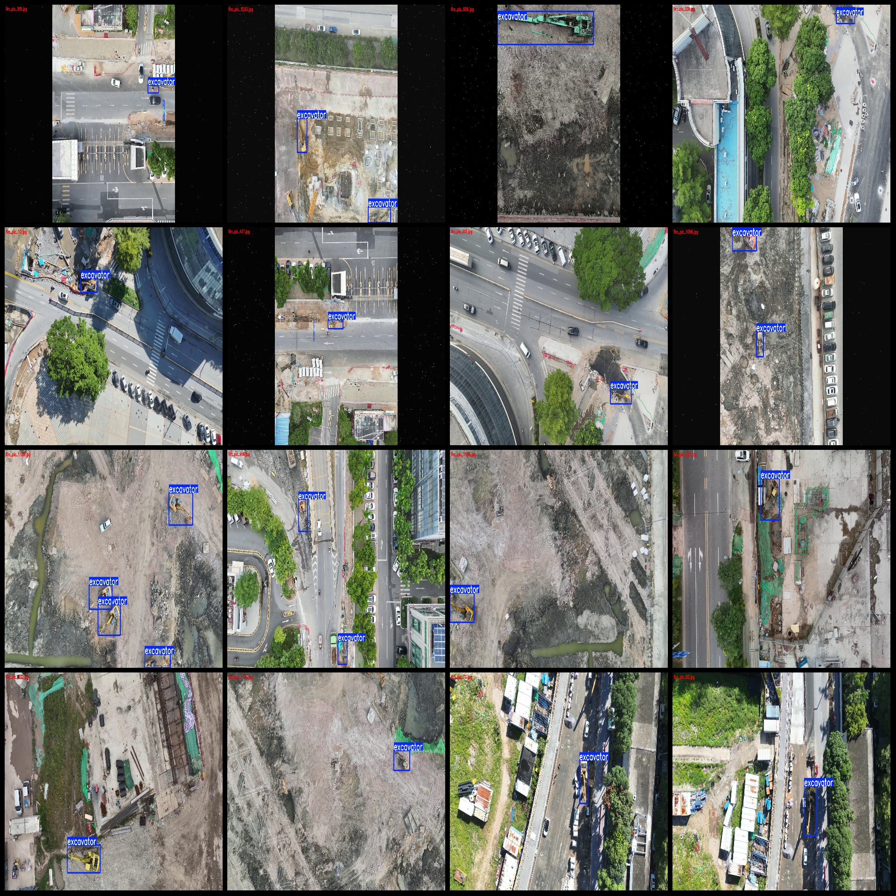

# Drone Perspective Aerial Photos Inspection Dataset for Excavators - VOC+YOLO Format with 1289 Images in 1 Category

Dataset format: Pascal VOC format + YOLO format (without split path txt files, only include jpeg images and corresponding VOC format xml files and YOLO format txt files)

Number of images (jpg file count): 1289
Number of annotations (xml file count): 1289
Number of annotations (txt file count): 1289
Number of categories: 1
Annotation category name: ["excavator"]
Number of boxes per category: 
- excavator boxes = 1719
- Total boxes = 1719
Number of images per category: 
- excavator images = 1289
Image resolution: 1920x1080
Annotation tool used: labelImg
Annotation rules: draw rectangle boxes for categories
Important note: The dataset does not have a split for training, validation, or test sets. Users must manually split the data.
Special statement: This dataset does not guarantee the accuracy of the trained models or weight files.
Image preview: 
Annotation example:

## Images

Here is a pay link on Stripe ( https://buy.stripe.com/3cs8yP7sY87d0vu9AB ). Please contact me lonlonago@foxmail.com after funding $89, and I will send you a complete data files , thank you!

